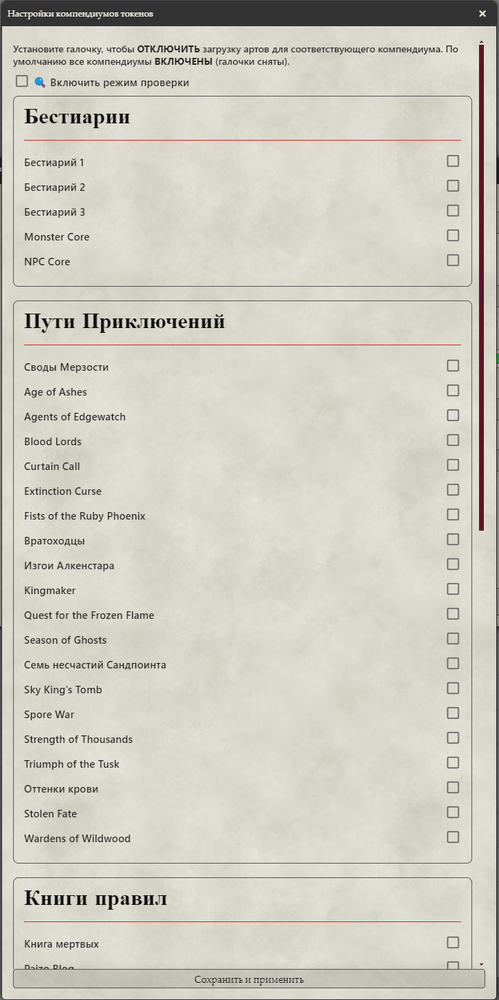
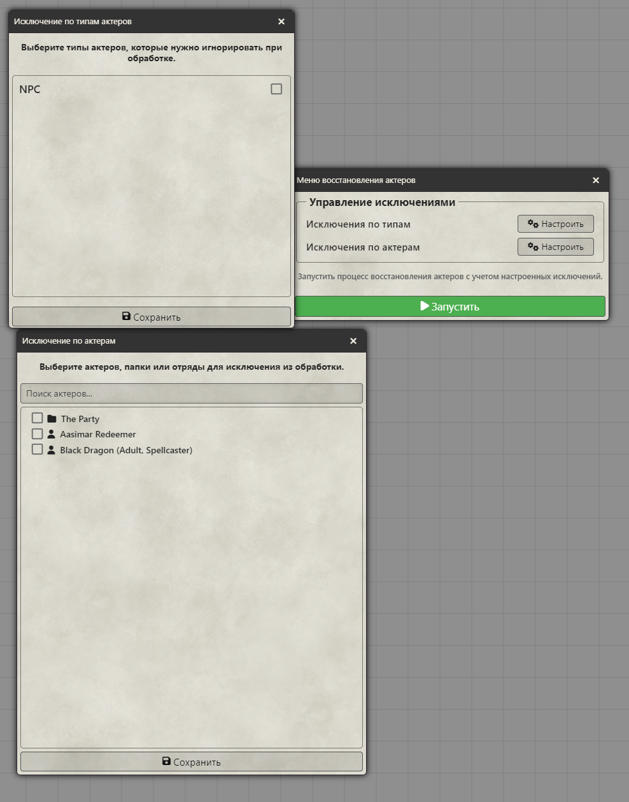
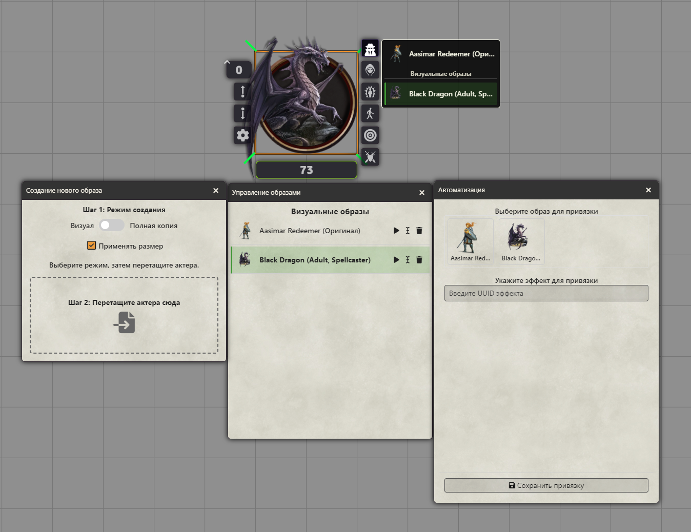
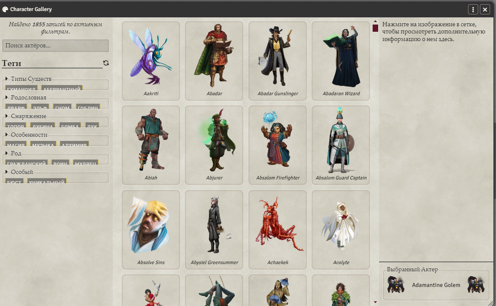

# Pathfinder 2E: Token Pack от Danya (для Foundry VTT v13)

[](https://github.com/Metofay/pf2e-token-pack/blob/v13/module.json)
[](https://github.com/Metofay/pf2e-token-pack/commits/v13)
[](https://boosty.to/metofay)
[](https://github.com/Metofay/pf2e-token-pack/blob/v13/README-en.md)


## 🐲 О модуле

**Pathfinder 2E: Token Pack** — это комплексный модуль для **Foundry VTT**, который не только добавляет огромную коллекцию токенов и артов для системы **Pathfinder 2e**, но и предоставляет мощные инструменты для управления вашим контентом.

### Ключевые возможности
* 🎨 **Огромная коллекция:** Тысячи готовых токенов для бестиариев, путей приключений и других книг правил.
* 🎭 **Маскировка NPC:** Продвинутый инструмент для смены внешности актеров, создания "фаз" и управления образами.
* 🛠️ **Утилиты для Мастера:** Функции для восстановления актеров на сцене и тонкой настройки компендиумов.
* 🖼️ **Галерея персонажей:** Дополнительный модуль с большой библиотекой артов.

---

## 📥 Установка

1.  В меню настройки модулей Foundry VTT нажмите **"Install Module"**.
2.  В поле **"Manifest URL"** вставьте следующую ссылку:
    ### [Для Foundry VTT v12](https://github.com/Metofay/pf2e-token-pack/tree/v12)
    ```
    https://raw.githubusercontent.com/Metofay/pf2e-token-pack/v12/module.json
    ```
    ### [Для Foundry VTT v13](https://github.com/Metofay/pf2e-token-pack)
    ```
    https://raw.githubusercontent.com/Metofay/pf2e-token-pack/v13/module.json
    ```
3.  Нажмите **"Install"** и дождитесь окончания установки.
4.  Активируйте модуль в настройках вашего игрового мира.

---

## ⚙️ Функционал модуля

### 1. Настройка компендиумов
Позволяет проверять пути к артам и токенам, удалять лишние файлы, видеть количество пропущенных актеров и отключать загрузку ненужных компендиумов для оптимизации работы мира.



### 2. Восстановление актеров
Восстанавливает актеров в боковой панели и на сцене до их исходного состояния в компендиуме. Можно настроить исключения по типам актеров и папкам.



### 3. Маскировка NPC
Позволяет менять внешность актера, создавать "фазы" (полностью отдельные, редактируемые листы персонажа), а также легко переключаться между ними и возвращаться к оригинальному виду.



**Дополнительные возможности:**
* **Быстрый доступ:** Удобное переключение образов прямо с токена.
* **Триггеры по эффектам:** Автоматическое применение образа при активации определённого эффекта на актере.
* **Гибкость:** Функция работает как для NPC, так и для других типов актеров (только визуальная смена).
* **Подсветка для ГМ:** Токены с образами подсвечиваются (виден только ГМ), с возможностью отключить подсветку.
* **Настройка:** Вы можете управлять цветом подсветки, типом обводки и расположением HUD элемента на токене.
* **Для игроков:** Игроки могут сами менять образы своих персонажей, если это разрешено.


### 4. Дополнительный модуль: Галерея персонажей
Добавляет большую, полностью локализованную библиотеку артов "Character Gallery" для изображений, которых нет в стандартных компендиумах.

* **Установка:** Требуется установить дополнительный модуль [**Pathfinder 2E: Token Pack (Character Gallery)**](https://github.com/Metofay/pf2e-token-pack-character-gallery).



---

## 📚 Покрытие контента

<details>
<summary>Нажмите, чтобы увидеть подробное покрытие контента</summary>

* ✅ - Есть динамические токены.
* ❌ - Есть недостающие арты (указано количество).

### Бестиарий

| Источник | Статус |
| :--- | :---: |
| Bestiary 1 | ✅ |
| Bestiary 2 | ✅ |
| Bestiary 3 | ✅ |
| Monster Core | ✅ |
| NPC Core | ✅ |

### Пути Приключений

| Источник | Статус | Примечания |
| :--- | :---: | :--- |
| Abomination Vaults | ✅ | |
| Age of Ashes | ✅❌ | Отсутствует 1 арт |
| Agents of Edgewatch | ✅❌ | Отсутствует 6 артов |
| Blood Lords | ✅❌ | Отсутствует 2 арта |
| Curtain Call | ✅ | |
| Extinction Curse | ✅❌ | Отсутствует 8 артов |
| Fist of the Ruby Phoenix | ✅ | |
| Gatewalkers | ✅❌ | Отсутствует 10 арт |
| Outlaws of Alkenstar | ✅ | |
| Kingmaker | ✅❌ | Отсутствует 1 арт |
| Quest for the Frozen | ✅ | |
| Season of Ghosts | ✅ | |
| Seven Dooms for Sandpoint | ✅ | |
| Sky King's Tomb | ✅❌ | Отсутствует 2 арта |
| Spore War | ✅ | |
| Strength of Thousands | ✅❌ | Отсутствует 14 артов |
| Triumph of the Tusk | ✅❌ | Отсутствует 10 арта |
| Shades of Blood | ✅ |  |
| Stolen Fate | ✅ | |
| Wardens of Wildwood | ✅ ❌ | Отсутствует 1 арт |

### Книга правил

| Источник | Статус | Примечания |
| :--- | :---: | :--- |
| Book of the Dead | | |
| Paizo Blog | ❌ | Отсутствует 3 арта |
| Howl of the Wild | ❌ | Отсутствует 16 артов |
| Lost Omens Bestiary | ✅❌ | Отсутствует 22 арта |
| NPC Gallery | ❌ | Отсутствует 3 арта |
| Dark Archive | ❌ | Отсутствует 1 арт |
| Rage of Elements | ❌ | Отсутствует 17 артов |
| War of Immortals | | |

### Приключения

| Источник | Статус | Примечания |
| :--- | :---: | :--- |
| Claws of the Tyrant | ❌ | Отсутствует 11 артов |
| Fall of Plaguestone | ❌ | Отсутствует 1 арт |
| Malevolence | ❌ | Отсутствует 3 арта |
| Menace Under Otari | | |
| One-Shots | ❌ | Отсутствует 9 артов |
| Prey for Death | | |
| Rusthenge | | |
| Shadows at Sundown | | |
| The Enmity Cycle | | |
| The Slithering | | |
| Troubles in Otari | | |
| Night of the Gray Death | ❌ | Отсутствует 3 арта |
| Crown of the Kobold King | ❌ | Отсутствует 2 арта |

### Pathfinder Society

| Источник | Статус | Примечания |
| :--- | :---: | :--- |
| Intro | ✅ | |
| Season 1 | ✅❌ | Отсутствует 67 артов |

### Pregenerated PCs

| Источник | Статус |
| :--- | :---: |
| Adventure Pregens | ✅❌ | Отсутствует 4 арта |

</details>

---

## ❤️ Поддержать автора

Если вам нравится моя работа, вы можете поддержать меня на Boosty. Это очень мотивирует на дальнейшее развитие модуля!

[](https://boosty.to/metofay)

